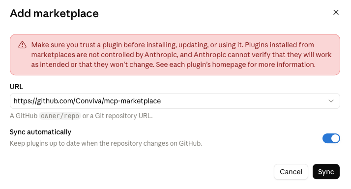
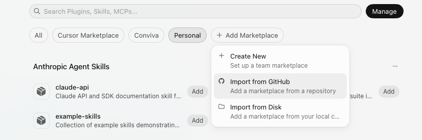
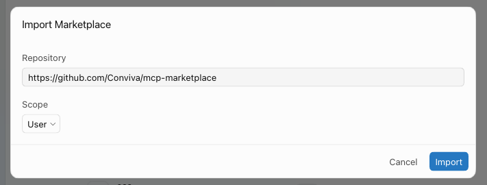
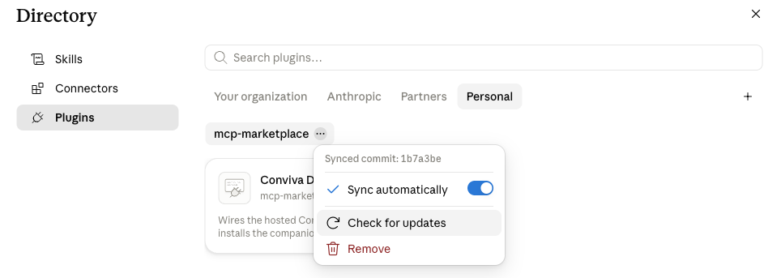
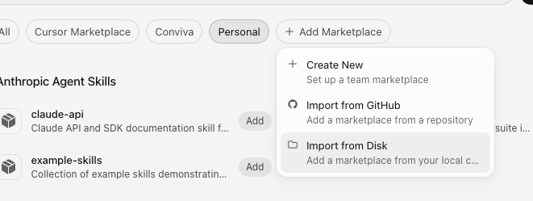

# Getting started

Connect to the hosted **Conviva DPI MCP** server. The steps depend on
which client you use:

- **Claude Code (CLI or desktop app)** — **one step**. Install the plugin; it
  wires the MCP server **and** the Context Center skills automatically.
- **Claude Desktop** — **one step**. Add the marketplace and install the plugin;
  you get the skills **and** the MCP server. (A custom connector is still there
  if you want the tools without the skills.)
- **Cursor** — install the plugin from a marketplace for **tools and skills**,
  or add just the MCP server to `mcp.json` for the **tools** alone.

Already installed? Jump to [Updating the plugin](#updating-the-plugin).

The hosted endpoint is:

```
https://dpi-mcp.conviva.com/mcp
```

All methods send you through **Okta login** (OAuth) on first use — no token to
paste.

> [!TIP]
> **When is Node.js needed?**
> The **plugin** (Claude Code, Cursor) and the **custom connector** (Desktop)
> connect to the endpoint natively — **no Node required**. Only the Desktop
> **manual config** uses the [`mcp-remote`](https://www.npmjs.com/package/mcp-remote)
> bridge, which runs on **Node.js 18+**.

---

## Claude Code — one step

Claude Code honors the plugin's bundled MCP server, so a single install gets you
both the tools and the skills. The steps below are identical in the terminal CLI
and in the Claude Code desktop app — both read the same `/plugin` marketplaces.

> [!IMPORTANT]
> **Requires Claude Code v2.1.143 or newer.** Older versions can't parse the
> marketplace and fail `/plugin marketplace add` with
> `Invalid schema … Unrecognized key: "displayName"`. Check your version with
> `claude --version` and update with `claude update` (or
> `npm i -g @anthropic-ai/claude-code@latest`), then retry.

1. Add the marketplace from the GitHub repo:

   ```
   /plugin marketplace add Conviva/mcp-marketplace
   ```

2. Install the plugin:

   ```
   /plugin install conviva-dpi-mcp@conviva
   ```

3. On first tool use, complete the **Okta login** in your browser.

> [!NOTE]
> **If the browser login lands on a `localhost` page and doesn't finish**
> Claude Code defaults the OAuth callback host to `localhost`
> (`http://localhost:<port>/callback`), so on a remote/SSH or container session
> the browser can't reach it and the login appears to stall. **Workaround:** copy
> the full `localhost` callback URL from the browser and paste it back into Claude
> Code at the prompt — it converts the URL into a short user code you can approve
> (including out-of-band, e.g. relayed from another machine). This is an upstream
> Claude Code default (an open feature request tracks making the callback host
> configurable), not a Conviva-side setting.

That's it — the `conviva` MCP server starts automatically (tools appear
as `mcp__conviva__…`) and the companion skills (`exploring-context-center`,
`querying-predefined-metrics`, `retrieving-behavior-segment-details`,
`finding-replay-candidates`, `analyzing-session-replays`) load alongside them.

> [!TIP]
> **Install scope**
> `/plugin install` defaults to **user** scope (all your projects). For a shared
> team setup, install at **project** scope so it's recorded in
> `.claude/settings.json` and committed with the repo.

Verify with `/plugin` (confirm it's enabled) or just ask Claude to list its
Conviva tools.

---

## Claude Desktop

Adding the marketplace and installing the plugin gets you **all the skills and
the `conviva` MCP server** — the same package Claude Code installs.

### Install the plugin

1. In Claude, open **Customize** in the left sidebar, then the **Plugins** tab.
2. Switch to the **Personal** tab and click **+**.
3. Paste the repo URL, leave **Sync automatically** on, and click **Sync**:

   ```
   https://github.com/Conviva/mcp-marketplace
   ```

   

4. From the marketplace entry that appears — Claude lists it under the **repo
   name**, so it reads `mcp-marketplace` rather than `conviva` —
   install **Conviva DPI MCP** (`conviva-dpi-mcp`).
5. On first tool use, complete the **Okta login** in your browser.

Plugins work the same in Claude on the web and in Cowork; in Cowork, open the
**Cowork** tab first, then **Customize**.

> [!TIP]
> **Leave "Sync automatically" on**
> It keeps the plugin current as we publish releases — see
> [Updating the plugin](#updating-the-plugin) for the manual path.

### Alternative — attach the MCP server without the plugin

If you want the **tools only** (no companion skills), skip the plugin and add
the hosted server directly. Pick **one** of the two ways — not both.

**Option A — Custom connector (recommended, no Node):**

1. Open **Settings → Connectors** (some builds label this **Customize → Connectors**).
2. Scroll to the bottom and click **Add custom connector**.
3. Enter the server URL (include `https://`) and click **Add**:

   ```
   https://dpi-mcp.conviva.com/mcp
   ```

4. Complete the **Okta login** when prompted.

> [!IMPORTANT]
> **Team / Enterprise accounts**
> The steps above are the self-serve path for **personal accounts**
> (Free / Pro / Max). On **Team** and **Enterprise** plans, members can't add a
> custom connector themselves — an **Owner** or **Primary Owner** must add it
> **once** at **Organization settings → Connectors**. It then appears in each
> member's connector list labelled **Custom**; every member clicks **Connect**
> and completes the **Okta login** individually. The connector works the same
> once added — only *who* adds it and *where* differ.

**Option B — Manual config (`mcp-remote` bridge, needs Node.js):**

1. Open the **Claude menu in your OS menu bar** (not the in-window settings) →
   **Settings… → Developer → Edit Config**. This opens
   `claude_desktop_config.json`:
   - macOS: `~/Library/Application Support/Claude/claude_desktop_config.json`
   - Windows: `%APPDATA%\Claude\claude_desktop_config.json`
2. Add the server under `mcpServers`:

   ```json
   {
     "mcpServers": {
       "conviva": {
         "command": "npx",
         "args": [
           "mcp-remote",
           "https://dpi-mcp.conviva.com/mcp"
         ]
       }
     }
   }
   ```

3. **Completely quit and restart Claude Desktop.**
4. A browser window opens for **Okta login**. After signing in, the MCP
   indicator appears in the input box and the tools are available.

> [!WARNING]
> **Don't run two copies**
> Use **either** the custom connector **or** the manual config — not both. If you
> previously added the server by hand and now switch to the connector, remove the
> `mcpServers` entry from `claude_desktop_config.json` first.

> [!TIP]
> **First-run OAuth**
> `mcp-remote` caches the broker token under `~/.mcp-auth/`. If login gets stuck or
> you rotate accounts, delete that directory and reconnect to restart the flow.

---

## Which Desktop method?

| Method | Where | You get | Needs |
| --- | --- | --- | --- |
| **Plugin** *(recommended)* | Customize → Plugins → Personal | Skills **and** MCP tools | — |
| **Custom connector** | Settings → Connectors *(org-level for Team/Enterprise)* | MCP tools only | — |
| **Manual config** | Developer → Edit Config | MCP tools only | Node.js 18+ |

The plugin is the one-step path. Use a connector or manual config only if you
want the tools without the companion skills.

---

## Cursor

### Option A — install the plugin (tools **and** skills)

Cursor installs plugins from a marketplace. Import this repository as one, then
install the plugin from it.

**Just for you (Personal marketplace):**

1. Open **Customize** in the sidebar and select the **Personal** tab.
2. Click **+ Add Marketplace → Import from GitHub**.

   

3. Enter the repo URL, leave **Scope** on **User**, and click **Import**:

   ```
   https://github.com/Conviva/mcp-marketplace
   ```

   

4. Back on the **Personal** tab, a **Conviva** section now lists **Conviva DPI
   MCP** (`conviva-dpi-mcp`) — click **Add**. The marketplace also gets its own
   **Conviva** tab, which filters to the same entry.

**For a whole team (admin, once per org — Teams/Enterprise):** open **Dashboard
→ Plugins → Team Marketplaces → Add Marketplace**, choose **Import from Repo**,
and enter `https://github.com/Conviva/mcp-marketplace`. Set **Marketplace Access** and, optionally, **Enable
Auto Refresh**. Members then install it from **Customize**, choosing user or
project scope.

Either way, finish by authenticating the bundled `conviva` MCP server with
**Okta** in your browser, then open a new chat and confirm the server and the
skills are enabled in **Customize**. Skills are invoked from the `/` menu.

If the GitHub import doesn't take, that's a
[known Cursor bug](#known-cursor-bug) — clone the repo and use **Import from
Disk** instead.

> [!TIP]
> **Testing with a local copy?**
> A marketplace install takes precedence over a same-named plugin in
> `~/.cursor/plugins/local`. Remove any local copy you were testing with, so
> you're sure which one you're looking at.

### Option B — MCP server only (tools, no skills)

Use this if you'd rather not add a marketplace at all. Cursor connects to remote
MCP servers natively — no plugin, no `mcp-remote`. You get the **tools** but not
the companion skills.

1. Add the server to your Cursor MCP config — **`~/.cursor/mcp.json`** (global,
   all projects) or **`.cursor/mcp.json`** (this project only):

   ```json
   {
     "mcpServers": {
       "conviva": {
         "url": "https://dpi-mcp.conviva.com/mcp"
       }
     }
   }
   ```

   Or use **Customize → MCP → Add** and enter the URL.

2. On first use Cursor opens a browser for **Okta login** (OAuth) — no key to
   paste. Cursor registers with the server automatically (dynamic client
   registration); its OAuth callback is `cursor://anysphere.cursor-mcp/oauth/callback`
   (desktop app) or `https://www.cursor.com/agents/mcp/oauth/callback` (web).

3. Under **Customize**, confirm the `conviva` server is toggled on; its tools
   then appear under **Available Tools** in chat. MCP logs live in the
   **Output panel → "MCP Logs"**.

---

## Updating the plugin

### Claude Code (CLI or desktop app)

Run these in a session, one at a time:

```text
/plugin marketplace update conviva
/plugin update conviva-dpi-mcp@conviva
/reload-plugins
```

`/reload-plugins` applies the new version without restarting; it needs Claude
Code **v2.1.260 or newer**, and in the desktop app it does **not** reconnect the
plugin's MCP server — start a new session to pick up server changes.

The same thing from a shell (useful in scripts) — pass the scope you installed
with, `user` by default:

```sh
claude plugin marketplace update conviva
claude plugin update conviva-dpi-mcp@conviva --scope user
```

> [!TIP]
> **Let Claude Code do it**
> Open `/plugin` → **Marketplaces** → `conviva` → **Enable
> auto-update**. Claude Code then refreshes the marketplace and updates the
> plugin in the background shortly after each session starts, and prompts you to
> run `/reload-plugins`. Third-party marketplaces have auto-update **off** by
> default, so this is opt-in.

### Claude Desktop

Updates are handled per **marketplace**, not per plugin. Open **Customize →
Plugins**, switch to the **Personal** tab, and click the **⋯** next to the
marketplace you added (listed by repo name, `mcp-marketplace`):



- **Sync automatically** (on by default when you added it) keeps the plugin
  current as we publish.
- **Check for updates** pulls immediately.
- The **Synced commit** line tells you exactly which revision you're on — compare
  it with the repo's latest commit if you're unsure.

Same place in Claude on the web and in Cowork. If you attached the server as a
**connector** instead of installing the plugin, that connector is independent:
the endpoint doesn't change between releases, so you never need to re-add it —
only re-authenticate if Claude prompts you.

### Cursor

Cursor keeps marketplace plugins up to date on its own — there is no update
button to press. New releases arrive through whichever marketplace you imported
this repo into:

- **Personal marketplace:** Cursor re-indexes the repo and updates the plugin.
  Restart Cursor and start a new chat to load the new skills. The marketplace
  stays registered under **Customize → Personal** — you don't re-import it per
  release.
- **Team marketplace:** an admin clicks **Refresh** in **Dashboard → Plugins**,
  or turns on **Auto Refresh** so pushes to the tracked branch are re-indexed
  (at most once every 10 minutes). Members pick up the refreshed version.

Confirm the version *and* the skill list under **Customize** — a plugin can show
a new version number while a chat still holds the previously loaded skills.

#### Known Cursor bug

> [!WARNING]
> **A GitHub marketplace can fail to install or update**
> Cursor's marketplace sync sometimes goes stale. The **Import from GitHub**
> either doesn't take, or it installs once and then stays pinned to an old
> commit with **Update** / **Reinstall** doing nothing. It's a Cursor-side issue —
> publishing another release on our end doesn't clear it. Background:
> [plugin update / version management](https://forum.cursor.com/t/plugin-update-version-management-how-are-installed-plugins-updated/166454/5)
> and [marketplace sync is stale](https://forum.cursor.com/t/plugin-marketplace-sync-is-stale-causing-update-reinstall-in-settings-to-have-no-effect/165660/5).
>
> **Workaround — install it as a local development plugin.** That path indexes
> the plugin from disk as it is right now and bypasses the stuck marketplace
> cache entirely.
>
> 1. **Remove the marketplace install first.** A marketplace install always takes
>    precedence over a same-named plugin in `~/.cursor/plugins/local/`, so
>    leaving it registered means nothing changes.
> 2. Clone the repo straight into Cursor's local-plugin folder:
>
>    ```bash
>    git clone https://github.com/Conviva/mcp-marketplace.git ~/.cursor/plugins/local/conviva-dpi-mcp
>    ```
>
>    It has to be a **real directory**. Cursor rejects a symlink whose target
>    lives outside that folder — `loadUserLocalPlugin … rejected: symlink target
>    … is outside …` — even though its docs suggest symlinking a checkout.
> 3. Run **Developer: Reload Window** in Cursor (or restart it), then confirm the
>    plugin and its skills under **Customize**.
> 4. **To update, just pull and reload:**
>
>    ```bash
>    git -C ~/.cursor/plugins/local/conviva-dpi-mcp pull
>    ```
>
>    followed by **Developer: Reload Window**. No cache to clear — this path
>    re-reads the directory every load.
>
> Clearing `~/.cursor/plugins/cache` and `~/.cursor/plugins/marketplaces`
> **doesn't** reliably move the pin, so don't count on that.
>
> **GUI alternative — Import from Disk.** If you'd rather not use the command
> line, clone the repo anywhere and add it via **Customize → Personal →
> + Add Marketplace → Import from Disk**:
>
> 
>
> This also bypasses the GitHub sync, but it comes with its own catch: the
> imported marketplace stays pinned to the commit Cursor first indexed and never
> re-fetches, so `git pull` alone won't move it. To update one of these you have
> to drop the pinned clone as well:
>
> ```bash
> git -C /path/to/your/clone pull
> rm -rf ~/.cursor/plugins/marketplaces/_ ~/.cursor/plugins/cache/conviva
> ```
>
> then **Developer: Reload Window**. The local-plugin path above avoids this
> entirely, which is why it's the one to prefer.

If you added the server via Option B instead, there is nothing to update: the
endpoint is fixed and new server-side tools appear on their own.

Updating the plugin updates its MCP configuration and its bundled skills. The
hosted MCP service is deployed separately — server-side tool changes reach you
without a plugin update.

---

## Verifying & troubleshooting

Ask Claude to list the available tools, or run a simple Context Center query.

- **401 / auth loop** — the OAuth flow didn't complete; retry the Okta login
  (manual config: clear `~/.mcp-auth/` first).
- **Claude Code login stalls on a `localhost` callback page** — Claude Code
  defaults the OAuth callback to `localhost`, which a remote/SSH or container
  session can't reach. Copy the `localhost` callback URL from the browser and
  paste it back into Claude Code to exchange it for a short approval code
  (upstream default; an open Claude Code feature request tracks making it
  configurable).
- **`/plugin marketplace add` fails with `Unrecognized key: "displayName"`** —
  your Claude Code is older than **v2.1.143**. Update with `claude update` (or
  `npm i -g @anthropic-ai/claude-code@latest`) and retry.
- **Tools missing in Claude Code** — run `/plugin`, confirm `conviva-dpi-mcp` is
  enabled, and start a new session so the MCP server boots.
- **Tools missing in Desktop** — confirm the plugin is installed and enabled
  under **Customize → Plugins → Personal**, then restart Claude. If you took the
  connector route instead: on **Team/Enterprise** plans the custom connector must
  first be added by an **Owner** at **Organization settings → Connectors** —
  members can only **Connect** to it, not add it. For manual config, check
  `claude_desktop_config.json` is valid JSON and that you fully restarted. Logs:
  `~/Library/Logs/Claude/mcp*.log` (macOS) /
  `%APPDATA%\Claude\logs\mcp*.log` (Windows).
- **Desktop stuck on an old version** — open **⋯ → Check for updates** on the
  marketplace and compare its **Synced commit** with the repo's latest commit.
- **Tools missing in Cursor** — under **Customize**, confirm the `conviva` MCP
  server is toggled on (and, with Option A, that the plugin itself is enabled);
  with Option B, check `mcp.json` is valid JSON. Read the **Output panel →
  "MCP Logs"** and retry the OAuth login.
- **Skills missing in Cursor** — skills only come with the **plugin** (Option A).
  An `mcp.json` entry gives you tools alone. Confirm the plugin is installed and
  enabled in **Customize**, then start a new chat.
- **Skills missing** — confirm the plugin is installed/enabled and start a new
  conversation. After an update, run `/reload-plugins` (Claude Code) — a version
  bump alone doesn't swap the skills a running session already loaded.

## References

- [Use plugins in Claude](https://support.claude.com/en/articles/13837440-use-plugins-in-claude)
- [Claude Code plugins reference](https://code.claude.com/docs/en/plugins-reference)
- [Claude Code plugin updates](https://code.claude.com/docs/en/discover-plugins#configure-auto-updates)
- [Cursor plugins](https://cursor.com/docs/plugins) — marketplaces, install scopes, Auto Refresh
- [Cursor plugins reference](https://cursor.com/docs/reference/plugins) — manifest and `mcp.json` format
- [Cursor — Model Context Protocol](https://cursor.com/docs/mcp)
- [Connect to remote MCP servers (Custom Connectors)](https://modelcontextprotocol.io/docs/develop/connect-remote-servers)
- [Connect to local MCP servers (Edit Config)](https://modelcontextprotocol.io/docs/develop/connect-local-servers)
